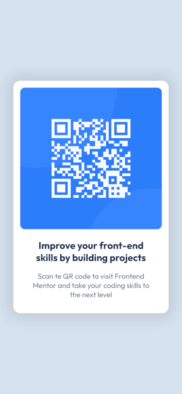
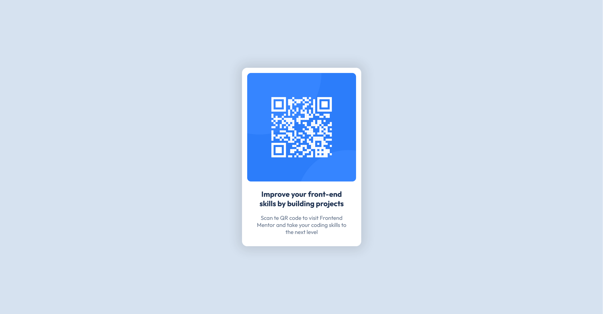

# Frontend Mentor - QR code component solution

This is a solution to the [QR code component challenge on Frontend Mentor](https://www.frontendmentor.io/challenges/qr-code-component-iux_sIO_H). Frontend Mentor challenges help you improve your coding skills by building realistic projects. 

## Table of contents

- [Overview](#overview)
  - [Screenshot](#screenshot)
  - [Links](#links)
- [My process](#my-process)
  - [Built with](#built-with)
  - [What I learned](#what-i-learned)
  - [Continued development](#continued-development)
  - [Useful resources](#useful-resources)
  - [AI Collaboration](#ai-collaboration)
- [Author](#author)
- [Acknowledgments](#acknowledgments)

**Note: Delete this note and update the table of contents based on what sections you keep.**

## Overview

Simple and responsive mobile-first design of a QR code component.

### Screenshot

### Links

- Solution URL: https://github.com/xavifrontendmentor/qr-code-component
- Live Site URL: https://xavifrontendmentor.github.io/qr-code-component/

## My process

It took me a long time to figure out how to create the main structure and how to use flexbox, but by reviewing some theory I'd been studying before the challenge, I gradually got on the right track. I considered making the code more complex, with media queries and other elements, but I ultimately decided that they weren't necessary for this first challenge, as I understand the goal was something simple, and my knowledge doesn't really extend much beyond that. Besides, the result I achieved was similar to what was asked of me.

### Built with

- Semantic HTML5 markup
- CSS custom properties
- Flexbox
- Mobile-first workflow

### What I learned

In summary, my learning was focused on simplifying as much as possible.

### Continued development

All.

### Useful resources

I tried to do my best with my own notes but this notes I taked were taken of this Youtube channel - https://www.youtube.com/@soydalto

### AI Collaboration

## Author

- Frontend Mentor - @xavifrontendmentor (https://www.frontendmentor.io/profile/xavifrontendmentor)

## Acknowledgments
